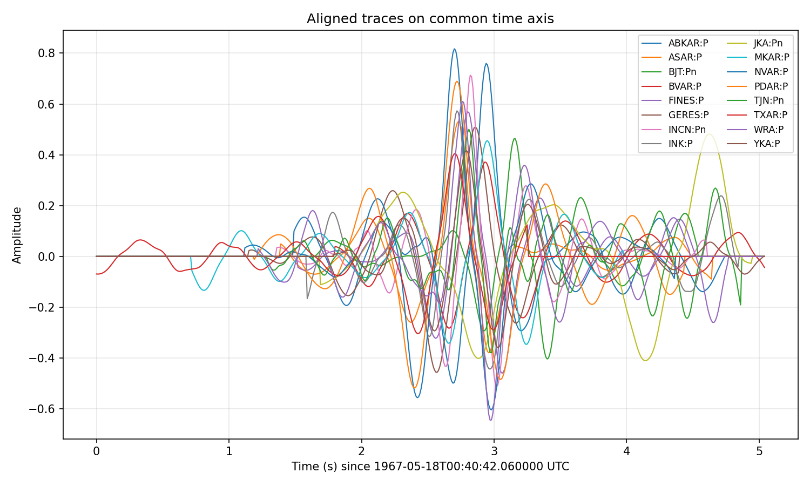
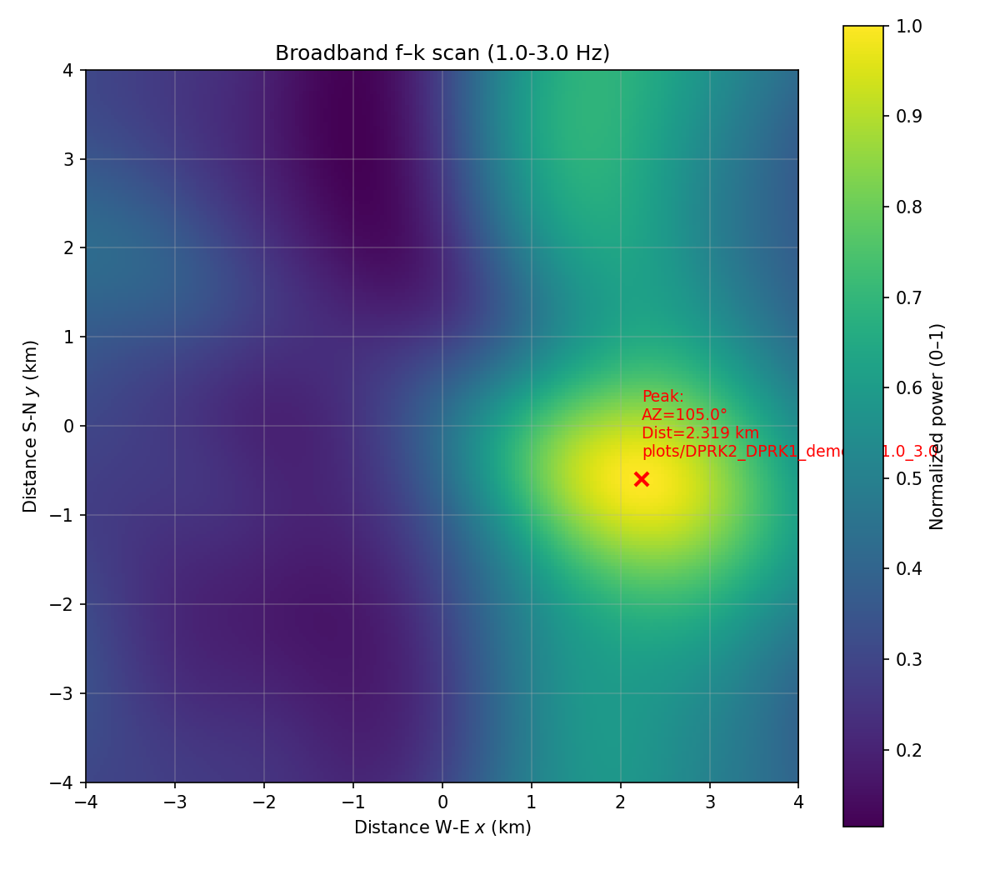

# fkrelloc  
Locate one seismic event relative to another using broadband f-k analysis on cross-correlation trace waveforms  

Release v1.0.0 is permanently stored on Zenodo with DOI 10.5281/zenodo.18213676

https://doi.org/10.5281/zenodo.18213676  

[](https://doi.org/10.5281/zenodo.18213675)  


[](https://api.eu.badgr.io/public/assertions/Bh5SV2k7SQSwQQuN1uTFRg "SQAaaS bronze badge achieved")

The folder *cc_trace_files* contains cross-correlation traces in SAC format generated by the program **ccdtest**
(see https://github.com/stevenjgibbons/ccdtest)  

We prepare a file that provide the names of the SAC files together with the station names, the phase names, and the slowness vectors 
(sx,sy) describing how that part of the wavefield leaves the source region. The sx and sy values can be obtained using the 
**statphase2slowvec** program (https://github.com/stevenjgibbons/statphase2slowvec).  

*DPRK2_DPRK1_demo_list.txt* is an example of such a file:  
```
cc_trace_files/DPRK2_DPRK1_ABKAR_P_cc.sac    ABKAR   P    -0.05770732  0.03931009
cc_trace_files/DPRK2_DPRK1_ASAR_P_cc.sac     ASAR    P     0.00499609 -0.05834497
cc_trace_files/DPRK2_DPRK1_BJT_Pn_cc.sac     BJT     Pn   -0.12350800 -0.00679578
cc_trace_files/DPRK2_DPRK1_BVAR_P_cc.sac     BVAR    P    -0.05910943  0.04524614
cc_trace_files/DPRK2_DPRK1_FINES_P_cc.sac    FINES   P    -0.03314312  0.05195921
cc_trace_files/DPRK2_DPRK1_GERES_P_cc.sac    GERES   P    -0.03279493  0.04146294
cc_trace_files/DPRK2_DPRK1_INCN_Pn_cc.sac    INCN    Pn   -0.05676922 -0.10989843
cc_trace_files/DPRK2_DPRK1_INK_P_cc.sac      INK     P     0.02928058  0.05818984
cc_trace_files/DPRK2_DPRK1_JKA_Pn_cc.sac     JKA     Pn    0.11597879  0.04300383
cc_trace_files/DPRK2_DPRK1_MKAR_P_cc.sac     MKAR    P    -0.07069660  0.03371665
cc_trace_files/DPRK2_DPRK1_NVAR_P_cc.sac     NVAR    P     0.03597500  0.03315638
cc_trace_files/DPRK2_DPRK1_PDAR_P_cc.sac     PDAR    P     0.03048417  0.03709658
cc_trace_files/DPRK2_DPRK1_TJN_Pn_cc.sac     TJN     Pn   -0.03370203 -0.11901505
cc_trace_files/DPRK2_DPRK1_TXAR_P_cc.sac     TXAR    P     0.02867614  0.02966610
cc_trace_files/DPRK2_DPRK1_WRA_P_cc.sac      WRA     P     0.00600661 -0.06063249
cc_trace_files/DPRK2_DPRK1_YKA_P_cc.sac      YKA     P     0.02699689  0.05222468
```

An example run is given by the script *run_demo_DPRK2_DPRK1_fk_loc.sh* which sets up the name of the file
and calls the python script *fkrelloc.py*.  

On typing  
```
sh run_demo_DPRK2_DPRK1_fk_loc.sh
```
you should obtain a text file providing an estimate of the location of event 1 relative to event 2:  
```
cat plots/DPRK2_DPRK1_demo_fk_1.0_3.0.txt
plots/DPRK2_DPRK1_demo_fk_1.0_3.0   2.2400  -0.6000  105.0   2.3190
```
indicating that the location of event **DPRK1** is estimated at 2.24 km to the East and 0.6 km to the South of event **DPRK2**.  

It should also generate a *png* and *pdf* file of the overlaid cross-correlation traces
(where the starting times are shifted relative to the start times of the waveform templates):  



and of the f-k scan providing the relative location estimate:  

  


